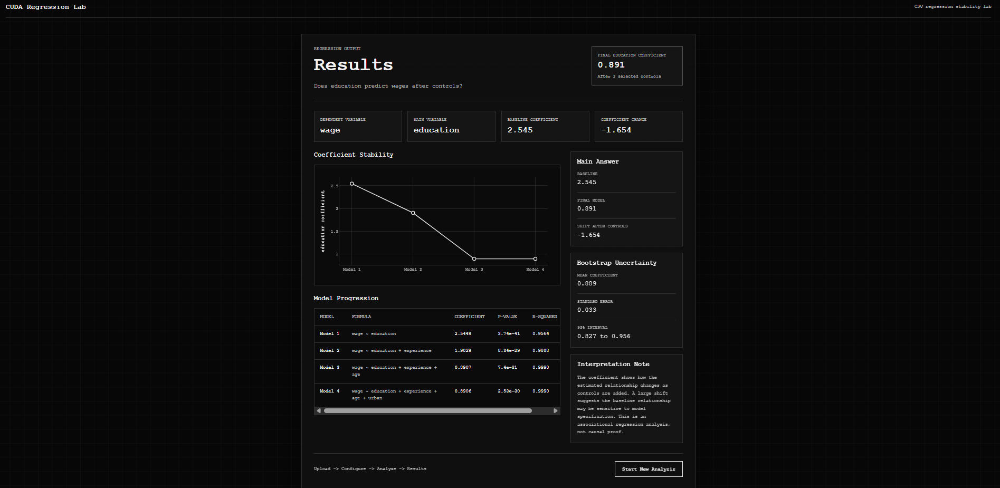

# CUDA Regression Lab

CUDA Regression Lab is a Python-first, browser-based regression stress-testing tool for students and researchers. Users upload a dataset, define a research question, choose a dependent variable, choose a main independent variable, add controls, and view regression stability results in a clean interactive dashboard.

## What Users Can Do

- Upload a CSV and inspect its columns instantly.
- Turn a research question into a regression setup.
- Pick dependent, main independent, and control variables.
- Run baseline and controlled OLS models in the browser.
- See how the main coefficient changes as controls are added.
- Review coefficients, p-values, and R-squared.
- Explore coefficient stability with an interactive Plotly chart.
- View bootstrap uncertainty and a bootstrap coefficient histogram.
- Offload expensive bootstrap workloads to CUDA-enabled GPU workers in the cloud
- Gain AI-generated insights into their regression results
-Exportable PDF/LaTeX Report

The goal is to help students, research assistants, and researchers quickly answer:

> Is this regression relationship stable, fragile, or misleading?

> How can I interpret the control variables in my model?

Expensive bootstrap workloads can be offloaded to CUDA-enabled GPU workers through RunPod Serverless.

